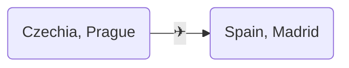

# 概要
AWS RDS/Auroraを利用しており、クライアントがSSL/TLSを使って接続している場合、Amazon RDS 認証局証明書（rds-ca-2019）の更新が2024/08までに必要。
[(AWS Document) SSL/TLS 証明書のローテーション](https://docs.aws.amazon.com/ja_jp/AmazonRDS/latest/UserGuide/UsingWithRDS.SSL-certificate-rotation.html)

# 対象の調査

## 認証局証明書がrds-ca-2019のRDSインスタンスの列挙

